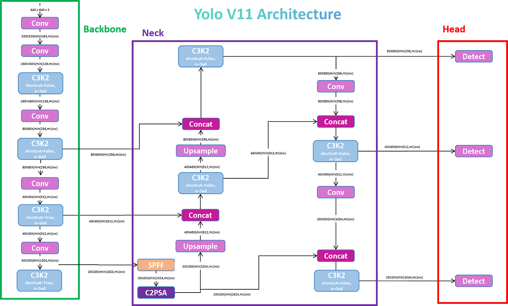

# YOLO Drum Component Detection
The goal of this project is to train a YOLOv11-based object detection model to identify an unrecognized object class.

As an amateur drummer, I decided to deal with drum components.

## Requirements
All the required libraries are listed in the `requirements.txt` file.

## Data
The dataset used for training was sourced from the [Roboflow Universe](https://universe.roboflow.com/troy-smith-akyo8/drums-6eqzp) platform. This small dataset consists of 58 images specifically for drum component detection. Each image is annotated with bounding boxes in the YOLOv11 format. There is a total of 4 classes:
- Bass Drum
- Floor Tom
- Rack tom
- Snare Drum 

The image dataset is provided already preprocessed, with the following steps:
* Auto-orientation of pixel data (with EXIF-orientation stripping)
* Resize to 640x640 (Stretch)

## Model
A pretrained YOLOv11 model is the starting point of the project. A schema of the model architecture is shown. 

### Train
Fine-tunes a pre-trained YOLOv11 model for custom object detection implementing a custom grid search for hyperparameter optimization.

Parameter and setting of the train phase (e.g. YOLO model type, hyperparameters such as frozen layer and early stopping) is defined in the `config/train_config.yaml` file.

For each combination of hyperparameters, train and evaluation results, as returned by the ultralytics library, can be found inside `runs/detect` folder. Additional classes and mean metrics are evaluated for validation data and saved as `custom_metrics.csv`. 
The best hyperparameter set is identified according to a global metric. Model weights are available as Pytorch file in the model folder as `weights/best.pt`.
For that model, performance on test data are evaluated and saved in `runs/detect/drums_model_test_results` folder.

#### Usage
1. Configure train settings in `config/train_config.yaml`.
2. Run the train script. Results for each hyperparameter set are saved in `runs/detect`. The best model is identified.

### Predict 
Module that allows to use a trained model to identify drum components in new images. 

#### Usage
1. Configure prediction settings in `config/predict_config.yaml`.
2. Place images in `images/raw`.
3. Run the predict script. Images are first loaded and pre-processed, predections are made and then saved in `images/predicted`